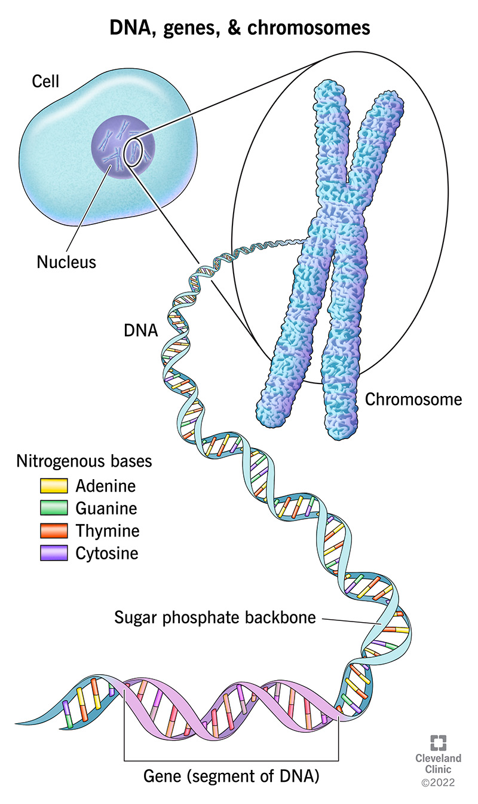
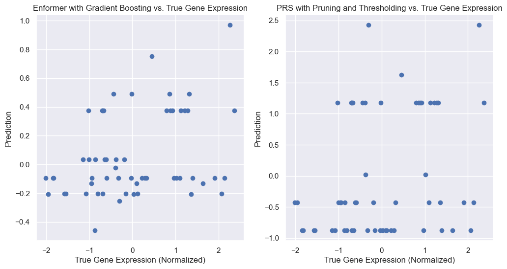
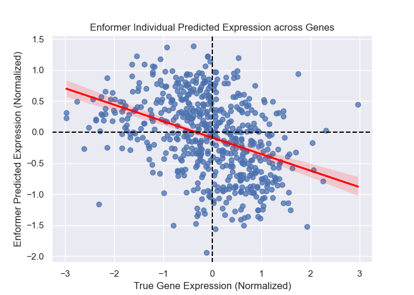
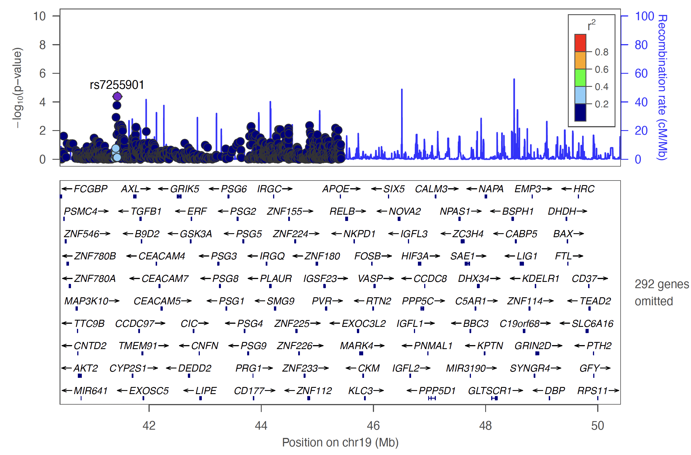
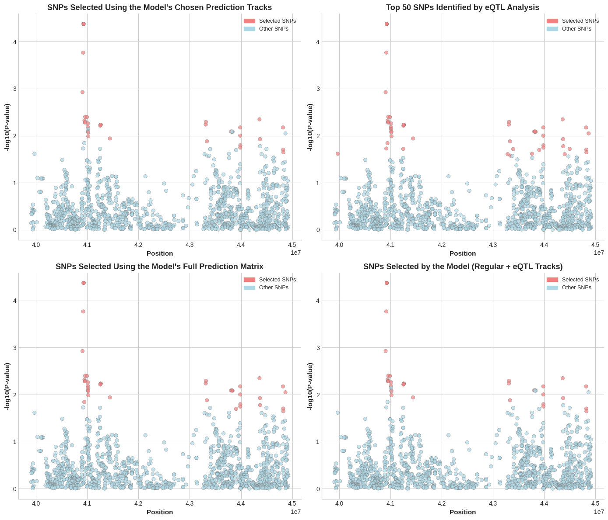

## 🏠 Welcome!  

📌 **Quick Links:**  [GitHub Repository](https://github.com/Kevinxsn/deep_learning_and_gene_expression)

---

## 🔍 Introduction  

Alzheimer’s Disease (AD) is a progressive neurodegenerative disorder, with **APOE** identified as the strongest genetic risk factor. Genome-wide association studies (GWAS) have uncovered genetic loci associated with AD, but they do not directly explain the impact of variants on gene expression. Expression quantitative trait loci (eQTL) analysis bridges this gap by linking genetic variants to transcriptional changes.

Recent advances in **deep learning** have enabled accurate prediction of gene expression from DNA sequences. Models like **Enformer** provide a powerful framework for understanding regulatory variants. Our study leverages deep learning to analyze how **SNPs within the APOE locus** influence gene expression and compares these predictions with eQTL findings to validate the model’s biological relevance.

---

## 🎯 Objectives  

- **Assess SNP effects** on the transcription of genes within the **APOE locus**.  
- **Predict gene expression** using the **Enformer** model and compare to eQTL analysis.  
- Evaluate **Polygenic Risk Scores (PRS)** (baseline vs. Pruning+Thresholding) in predicting gene expression.  
- Determine if **stacked ensemble models** enhance predictive accuracy for AD risk assessment.  

---

## 🛠 Methods  

### **Data Processing**  
1. **Genotype Data**: We processed **GTEx** genotype files (in PLINK/VCF formats) to capture individual genetic variants.  
2. **Reference Genome (hg38)**: Used as a baseline sequence before applying SNP modifications.  
3. **Gene Expression**: Extracted from GTEx; serves as the “ground truth” to evaluate Enformer’s predictive performance.

### **Constructing Genotype-Informed Sequences**  
- **Extract Reference Sequences**: Split `hg38` into manageable fragments (e.g., Chromosome 22).  
- **Apply SNP Variants**: Use genotype data (PLINK/VCF) to replace the reference base at each SNP position with the corresponding allele.  
- **One-Hot Encoding**: Convert nucleotide sequences (A, C, G, T, N) into 4-channel tensors for deep learning input.

### **Running Enformer**  
1. **Input Preparation**: Load the **genotype-informed FASTA** files.  
2. **Model Execution**: The **pre-trained Enformer** (optionally fine-tuned) predicts gene expression signals across multiple genomic bins.  
3. **Stacked Model**: Combine Enformer outputs with other regression models (e.g., **Random Forest**, **Gradient Boosting**, **XGBoost**) to optimize performance.  

### **Prediction of a Single Gene Across All Samples**  
1. **Select Target Gene**: Identify the gene with strong eQTL signals (e.g., ENSG00000167077.12).  
2. **Enformer vs. PRS**: Compare Enformer predictions with **Baseline PRS** and **Pruning & Thresholding (P+T) PRS** across all individuals.  
3. **Evaluation**:  
   - **Z-score normalization** for standardized scale  
   - **Log transformation** to reduce outlier effects  
   - **Mean Squared Error (MSE)**, **R\(^2\)**, and **Pearson correlation** as metrics  

### **Prediction Across Multiple Genes**  
- **Normalization**: Apply **quantile normalization** and z-score transformation to the Enformer predictions for all genes.  
- **Machine Learning Models**:  
  1. **Ridge Regression**  
  2. **Polynomial Regression**  
  3. **Random Forest Regressor**  
  4. **Elastic Net**  
  5. **XGBoost**  
- **Stacking**: Use a meta-learner (XGBoost) on top of the above models to boost accuracy further.

### **SNP Effect Quantification**  
1. **Reference vs. Alternative**: For each SNP, generate two sequences—one with the reference allele, one with the variant allele.  
2. **Model Outputs**: Obtain Enformer predictions for each version and calculate the **absolute difference** in signal.  
3. **Track Selection**: Compare SNP effects using the **Full Prediction Matrix** vs. **Selected Regulatory Tracks** (e.g., “H3K27me3,” “H3K9me3”).  
4. **eQTL Overlap**:  
   - Merge top SNPs identified by Enformer with SNPs from **traditional eQTL analysis**.  
   - Evaluate the **overlapping SNPs** to confirm biological relevance.

---

## 📊 Results & Impact  

### **Selected Gene Prediction**  
We compared:
1. **Enformer + Gradient Boosting**  
2. **PRS (P+T)**  
3. **Baseline PRS**  

**Key Finding**: Enformer + Gradient Boosting achieved an \(R^2\) of 0.10, matching or exceeding PRS (P+T), while the Baseline PRS lagged with \(R^2\) of 0.07.

### **Individual-Level Prediction Across Genes**  
By stacking Enformer outputs with additional ML models, we achieved an \(R^2 = 0.11\). This approach captures **cross-gene regulatory interactions**, surpassing single-model benchmarks.

### **APOE eQTL Analysis**  
Focusing on a region **500 kb downstream** and **10 kb upstream** of APOE, we found strong eQTL signals. Deep learning and eQTL results overlapped significantly:  
- **Full Prediction Matrix vs. eQTL**: 41 overlapping SNPs  
- **Chosen Tracks vs. eQTL**: 33 overlapping SNPs  

### **Comparison of SNPs Identified**  
Comparisons show **Full Matrix** slightly outperforms the targeted track approach, with a 40-SNP overlap vs. 33.

---

## 🎯 Conclusion & Next Steps  

**Conclusion**:  
1. **Transformer-based Enformer** can match or exceed linear models and PRS in pinpointing functionally relevant SNPs.  
2. **Stacked ensemble approaches** further boost prediction accuracy and capture multi-gene regulatory patterns.

**Future Directions**:  
- **Expand to multiple tissues** for a more comprehensive view of SNP effects.  
- **Refine interpretability** via saliency maps or attention-weight visualization.  
- **Experimental Validation** of top SNP candidates with CRISPR or ChIP-seq.  

---

## 📬 Get in Touch  
- **GitHub**: [Kevinxsn/deep_learning_and_gene_expression](https://github.com/Kevinxsn/deep_learning_and_gene_expression)  
- **Contact**:  
  - Sunan Xu – `sux002@ucsd.edu`  
  - Yunpeng Zhao – `yuz159@ucsd.edu`  
  - Pallavi Prabhu – `pprabhu@ucsd.edu`  
  - Nan Huang – `n5huang@ucsd.edu`  
  - Tiffany Amariuta-Bartell – `tamariutabartell@ucsd.edu`  

We welcome any questions or suggestions for further exploration.
